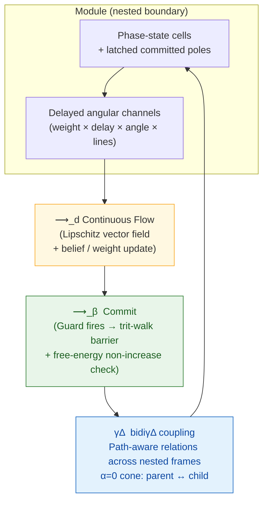
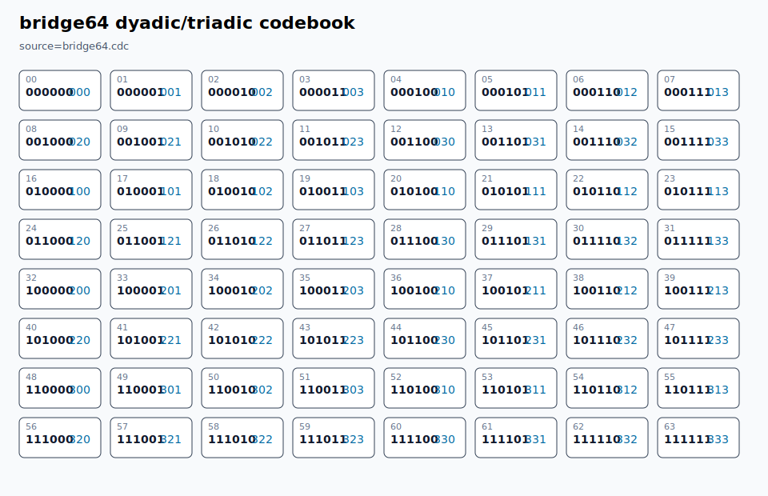

# BiDi Coherence-Delta Calculus

<p align="center">
  
</p>

<p align="center">
  <strong>A native language with a formal coherence-calculus kernel</strong><br>
  Continuous flow • Balanced-ternary commits • Delayed angular channels • Operational bridge coordinates • Trace/window measurement
</p>

BiDi Coherence-Delta Calculus is a native `.cdc` language whose semantic kernel
is a compact coherence calculus. It models computation as nested boundary
modules of phase-state cells, connected by delayed weighted channels that may
also carry angular phase bias, dimension projection, and path-aware cross-scale
endpoints. Fields evolve through continuous flow and periodically commit through
event-triggered balanced-ternary invariant gates. A derived trace/window layer
lets any module, relation, or projected boundary act as observer, participant,
or measurement interface without adding a binary observer primitive.

## Center Of Gravity

CDC is the language. The calculus is the kernel semantics.

That gives the project two separate success stories:

- **Language success:** developers can install `cdc`, write `.cdc`, run `.cdc`,
  test `.cdc`, and eventually build/package `.cdc` programs without touching the
  construction host.
- **Calculus success:** the language kernel has explicit terms, reductions,
  invariants, witnesses, and theorem-prover obligations.

The only Python file left is `cdc_boot.py`, a minimal bootloader that reads
native `.cdc` declarations and verifies expectations. It is not the calculus.
The 64-state bridge has a separate non-Python runtime in
`runtime/cdc_bridge_runtime.c` that consumes `bridge64.cdc` as a lookup table.

## Native Status

This repository is on a native `.cdc` self-hosting track. The removal plan is
explicit in `NATIVE_SELF_HOSTING_MANDATE.md`: all current host behavior must be
replaced by native `.cdc` semantics and witnesses before host files are deleted
without breaking verification.

The practical bootloader decision for this release is now enforced by the repo:
Python is allowed only as `cdc_boot.py`. `.cdc` owns the source terms, declared
reducer rules, proof obligations, capability witnesses, and self-hosting
contract.

## Installation & Exploration

Requires Python >= 3.10 and a C compiler (`cc`) for the full verification gate.
There are no package dependencies.

```bash
git clone https://github.com/ETEllis/bidi-coherence-delta-calculus.git
cd bidi-coherence-delta-calculus
./scripts/verify.sh          # Full verification gate (start here)
python3 cdc_boot.py          # Native .cdc contract/witness verification
```

Editable install:

```bash
pip install -e .
```

## Core Architecture



**Canonical vocabulary**
- `cell` — continuous phase-state carrier with latched pole
- `channel` — directed influence with delay, weight, angular phase, and optional line projection
- `module` — bounded group with read/write cones, belief, prior
- `field` — graph of modules + channels under monoidal composition
- `commit` — discrete update enforcing a balanced-ternary nonnegative balance invariant
- `bidiγΔ` — bidirectional coherence-delta across nested reference frames and path endpoints
- `window` — derived observer projection over a field, producing ternary traces and measurement records

## Why This Substrate Exists

Modern hybrid systems routinely combine continuous simulation or control, evented transitions, delayed feedback, policy invariants, local learning, predictive belief updates, and nested scale coupling — usually implemented in fragmented toolkits.

This calculus supplies one shared, executable vocabulary and verified reference semantics for all of them under a single coherence-preserving spine.

## Novelty at a Glance

- **`bidiγΔ` operator** — first-class bidirectional coherence exchange across distinct reference frames; nesting is the `α=0` special case of the same relation operator.
- **Angular/path channels** — channels can rotate incoming phase by `angle=`, project onto selected `lines=`, and connect paths such as `P/c -> P`.
- **Trace/window observer layer** — any module, relation, or projected boundary can hold a causal window; committing measurements are guarded balanced-ternary commits.
- **Trace-order locality** — phase-time can flow smoothly while event-time remains local to the observing window; there is no required global tick.
- **Recursive window policy** — observer windows can carry local counters and projection/update policy without adding a binary observer or global clock.
- **Balanced-ternary carrier** — committed values are `-1 / 0 / +1` around real equilibrium, not binary false/true labels.
- **Existence viability** — frames persist by preserving bounded coherent continuity while retaining mode-appropriate transition capacity.
- **64-state dyadic/triadic bridge** — `bridge64.cdc` declares every `2^6 = 4^3 = 64` codebook row for bootstrap/runtime bridge design.
- **Operational bridge runtime** — `runtime/cdc_bridge_runtime.c` parses `bridge64.cdc`, verifies bijection, performs dyadic/triadic lookup, projects trace trits into bridge coordinates, and emits a 64-cell grid/SVG.
- **Trit-walk barrier + nonnegative balance** — clean discrete guard preventing rank violation on continuous-to-discrete quantization.
- **Native free-energy witnesses** — commits are guarded against Φ increase; continuous flow has explicit subset obligations.
- **`.cdc` literate DSL** — single source format declaring fields, modules, channels, guards, flows, and proof obligations.
- **Native kernel contract** — `kernel.cdc` starts the self-hosting path by declaring calculus terms, reducer rules, capabilities, and the shrinking bootloader boundary.
- **Minimal bootloader** — `cdc_boot.py` only loads `.cdc`, checks declarations, and reports expectations.

Core metatheorems and bridge invariants are witnessed by native `.cdc`, with
the finite discrete layer positioned as the first theorem-prover target.

## Verification Status (v0.2.2)

The package passes 100%:

- 1/1 Python bootloader file: `cdc_boot.py`
- 148/148 native `.cdc` expectations
- 13/13 native invariant declarations
- 25/25 native capability declarations
- 140/140 native witness declarations
- C bridge runtime compile, lookup, trace-coordinate, higher-arity, and grid/SVG checks
- Paper compile through `tectonic` when available

Run the full gate anytime:

```bash
./scripts/verify.sh
```

## Native `.cdc` Example

```cdc
kernel bidi stage=2 target=cdc
  term cell channel module field counter trace window measurement bridge policy
  rule flow commit nest relation trace trace-order window measure adapt synchronize
  provides native-witness-suite native-capability-suite
  bootloader read-source parse-lines collect-native-declarations verify-expectations report
  expect native substrate == cdc
  expect python-files == 1
  expect witnesses >= 140
end
```

## Operational Bridge

<p align="center">
  
</p>

The bridge is operational, not only declared:

```bash
build/cdc_bridge_runtime verify bridge64.cdc
build/cdc_bridge_runtime lookup-dyadic bridge64.cdc 101011
build/cdc_bridge_runtime lookup-triadic bridge64.cdc 223
build/cdc_bridge_runtime project-trits bridge64.cdc '+0-+0-' council
build/cdc_bridge_runtime codebook 9
build/cdc_bridge_runtime codebook 12
```

`./scripts/verify.sh` compiles the runtime, runs those checks, and confirms that
the tracked 64-cell SVG matches runtime output. Details are in
`BRIDGE_RUNTIME.md`.

## Paper

Knuth-inspired, dependency-light literate paper:

- Source: `paper/arxiv/main.tex`
- The checked source tree is the current paper source; `./scripts/verify.sh` compiles it when `tectonic` is available.

Compile locally (TeX toolchain):

```bash
cd paper/arxiv && pdflatex main.tex && pdflatex main.tex
```

## Boundaries & Next

Native witness declarations are not mechanized proofs. The formalization spine
for the next pass (immutable runtime state tuple, small-step relations for
flow/commit/nest, port to Lean/Coq/Kani) is in `FORMAL_SEMANTIC_SPINE.md`.

Claim-to-witness-to-proof tracking is in `VERIFICATION_OBLIGATION_MATRIX.md`.
The observer/measurement extension is documented in `TERNARY_TRACE_WINDOW_SEMANTICS.md`.
The native self-hosting mandate is documented in `NATIVE_SELF_HOSTING_MANDATE.md`.

Current work delivers a compact, verified substrate — not production scaling, biological completeness, or a finished physics theory.

## License

MIT License. See `LICENSE`.

---

If this substrate proves useful, cite via `CITATION.cff` or the paper.
